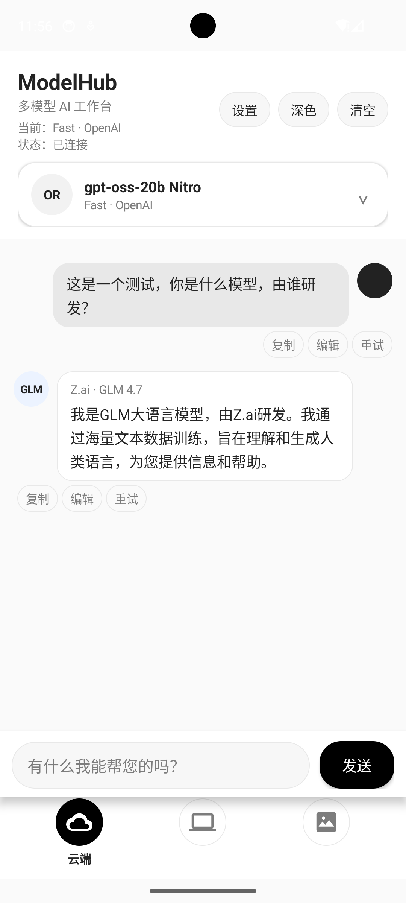
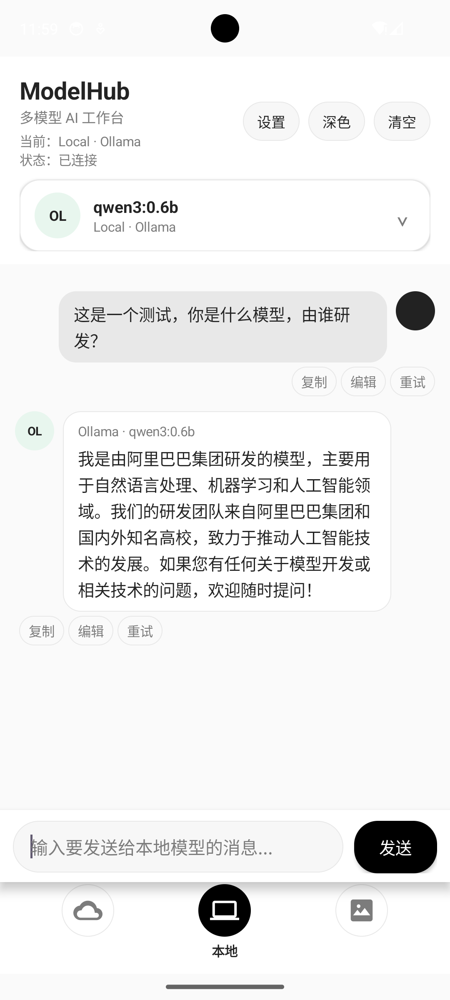
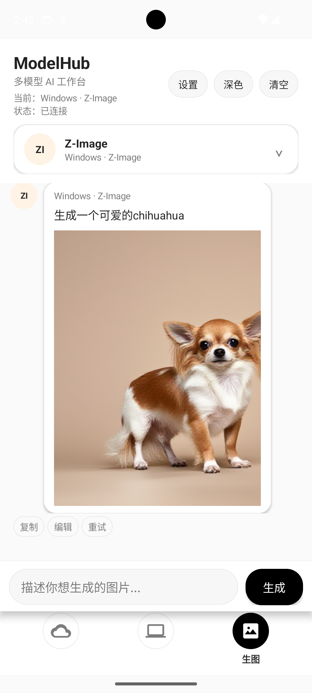

<p align="center">
  
</p>

<h1 align="center">ModelHub</h1>

<p align="center">一个原生 Android 多模型 AI 工作台</p>

<p align="center">
云端 OpenRouter 对话 · 本地 Ollama 对话 · Windows ComfyUI 远程生图，三种模式随时切换
</p>

---

## 功能

- **云端模式**：填入你自己的 [OpenRouter](https://openrouter.ai/) API Key，点击"获取模型"动态拉取你账号下可用的模型列表，流式输出对话内容。
- **本地模式**：连接局域网内运行的 [Ollama](https://ollama.com/) 服务，刷新并选择本地已安装的模型进行对话。
- **生图模式**：连接局域网内运行的 [ComfyUI](https://github.com/comfyanonymous/ComfyUI) 服务，填入模型 checkpoint 文件名，输入描述即可生成图片。
- 深色模式、聊天记录本地持久化、三种模式各自独立的会话历史。

## 截图

<table>
<tr>
<td></td>
<td></td>
<td></td>
</tr>
<tr>
<td align="center">云端模式</td>
<td align="center">本地模式</td>
<td align="center">生图模式</td>
</tr>
</table>

## 运行环境

**构建**

- Android Studio（最新稳定版）
- JDK 11
- Android Gradle Plugin 9.1.1（已在 `gradle/libs.versions.toml` 锁定，Gradle Sync 自动下载）
- compileSdk / targetSdk 36，minSdk 26（Android 8.0 及以上设备/模拟器）

**第三方库**（已在 `app/build.gradle` 声明，无需手动安装）

- AndroidX：core-ktx、appcompat、activity、constraintlayout
- Material Components
- OkHttp 4.12.0 + okhttp-dnsoverhttps

**按需准备的外部服务**（只在用到对应模式时才需要，三者互不依赖）

| 模式 | 需要的服务 | 获取方式 |
| --- | --- | --- |
| 云端 | OpenRouter 账号 + API Key | [openrouter.ai](https://openrouter.ai/) 注册后在控制台生成 |
| 本地 | 局域网内运行 Ollama，并已 `ollama pull` 至少一个模型 | [ollama.com](https://ollama.com/) 下载安装 |
| 生图 | 局域网内运行 ComfyUI，并已放好对应的 checkpoint 文件 | [ComfyUI](https://github.com/comfyanonymous/ComfyUI) 官方仓库 |

## 运行方式

1. 用 Android Studio 打开本项目，等待 Gradle 同步完成。
2. 连接真机或启动模拟器，点击 Run 运行 `app` module。
3. 首次启动后 App 内所有数据均为空，在设置面板里按下表填入对应模式的配置：

| 模式 | 需要填写的内容 |
| --- | --- |
| 云端 | OpenRouter API Key |
| 本地 | 本地 Ollama 服务地址，如 `http://10.0.2.2:11434`（模拟器访问主机回环地址） |
| 生图 | ComfyUI 服务地址（如 `http://192.168.x.x:8188`）+ checkpoint 文件名 |

## 技术栈

- Kotlin + AndroidX，原生 View 构建 UI（无 XML 布局，纯代码搭建）
- OkHttp 进行网络请求，支持 OpenRouter 流式 SSE 响应
- 自定义 DNS-over-HTTPS 回退链路（阿里 DNS / DNSPod / Cloudflare），缓解部分网络环境下 OpenRouter 域名解析失败的问题

## 目录结构

```
app/src/main/java/com/example/modelhub/
├── MainActivity.kt          # 入口与三种模式的业务编排
├── network/                 # OpenRouter / Ollama / ComfyUI 三个网络客户端
├── storage/                 # SharedPreferences 封装
├── ui/                      # 自定义 ChatView 与模型选择 UI
└── data/                    # 消息数据模型
```

## 隐私说明

所有配置项（API Key、服务器地址、checkpoint 文件名等）只保存在你本机的 `SharedPreferences` 里，不会上传到任何第三方服务器。仓库源码中不包含任何密钥、内网地址或预设模型名称——这些都需要使用者在 App 内自行填写。如果你 fork 本项目，请同样注意不要把自己的密钥或内网信息提交进版本库。
