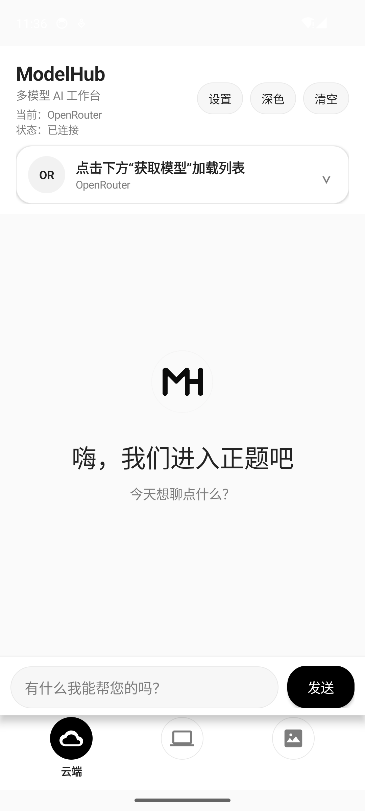
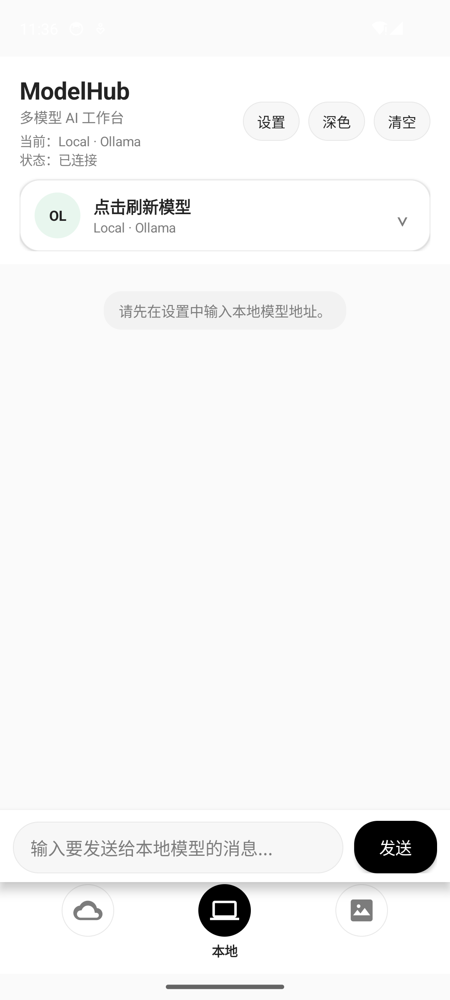
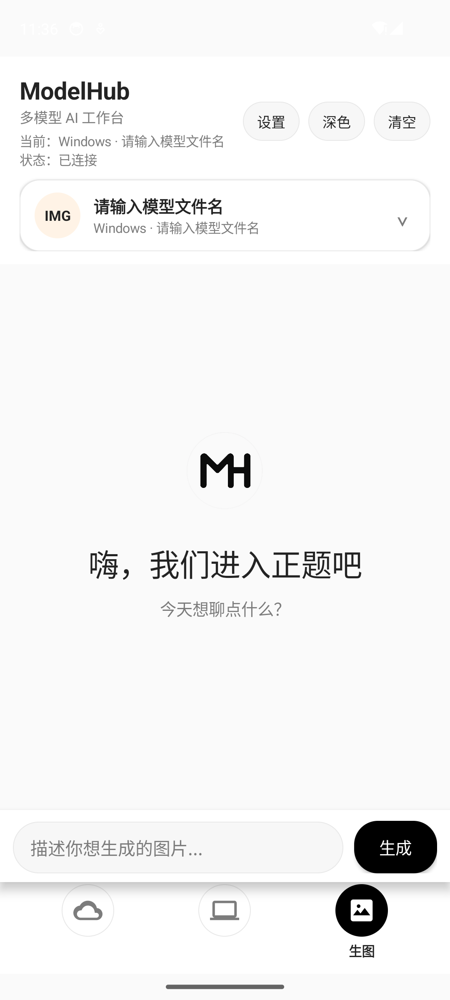

# ModelHub

一个原生 Android 多模型 AI 工作台，三种模式切换：云端 OpenRouter 对话、本地 Ollama 对话、Windows ComfyUI 远程生图。

## 功能

- **云端模式**：填入你自己的 [OpenRouter](https://openrouter.ai/) API Key，点击"获取模型"动态拉取你账号下可用的模型列表，流式输出对话内容。
- **本地模式**：连接局域网内运行的 [Ollama](https://ollama.com/) 服务，刷新并选择本地已安装的模型进行对话。
- **生图模式**：连接局域网内运行的 [ComfyUI](https://github.com/comfyanonymous/ComfyUI) 服务，填入模型 checkpoint 文件名，输入描述即可生成图片。
- 深色模式、聊天记录本地持久化、三种模式各自独立的会话历史。

## 截图

<table>
<tr>
<td></td>
<td></td>
<td></td>
</tr>
<tr>
<td align="center">云端模式</td>
<td align="center">本地模式</td>
<td align="center">生图模式</td>
</tr>
</table>

## 运行方式

1. 用 Android Studio 打开本项目。
2. 等待 Gradle 同步完成。
3. 连接真机或启动模拟器，点击 Run 运行 `app` module。

首次启动后，App 内所有数据均为空，需要你自己在设置面板里填入：

| 模式 | 需要填写的内容 |
| --- | --- |
| 云端 | OpenRouter API Key |
| 本地 | 本地 Ollama 服务地址，如 `http://10.0.2.2:11434`（模拟器访问主机回环地址） |
| 生图 | ComfyUI 服务地址（如 `http://192.168.x.x:8188`）+ checkpoint 文件名 |

所有配置项均保存在设备本地（`SharedPreferences`），不会上传到任何第三方服务器，仓库中也不包含任何密钥或内网地址。

## 技术栈

- Kotlin + AndroidX，原生 View 构建 UI（无 XML 布局，纯代码搭建）
- OkHttp 进行网络请求，支持 OpenRouter 流式 SSE 响应
- 自定义 DNS-over-HTTPS 回退链路（阿里 DNS / DNSPod / Cloudflare），缓解部分网络环境下 OpenRouter 域名解析失败的问题

## 目录结构

```
app/src/main/java/com/example/modelhub/
├── MainActivity.kt          # 入口与三种模式的业务编排
├── network/                 # OpenRouter / Ollama / ComfyUI 三个网络客户端
├── storage/                 # SharedPreferences 封装
├── ui/                      # 自定义 ChatView 与模型选择 UI
└── data/                    # 消息数据模型
```

## 隐私说明

本仓库不包含任何 API Key、内网 IP 或预设模型名称——这些都需要使用者在 App 内自行填写。如果你 fork 本项目，请同样注意不要把自己的密钥或内网信息提交进版本库。

## License

暂未添加开源协议。如果你想让别人可以自由使用/修改这份代码，可以在 GitHub 仓库页面点击 "Add file" → "Create new file"，文件名输入 `LICENSE`，GitHub 会提示你选择协议模板（个人项目常用 MIT）。
